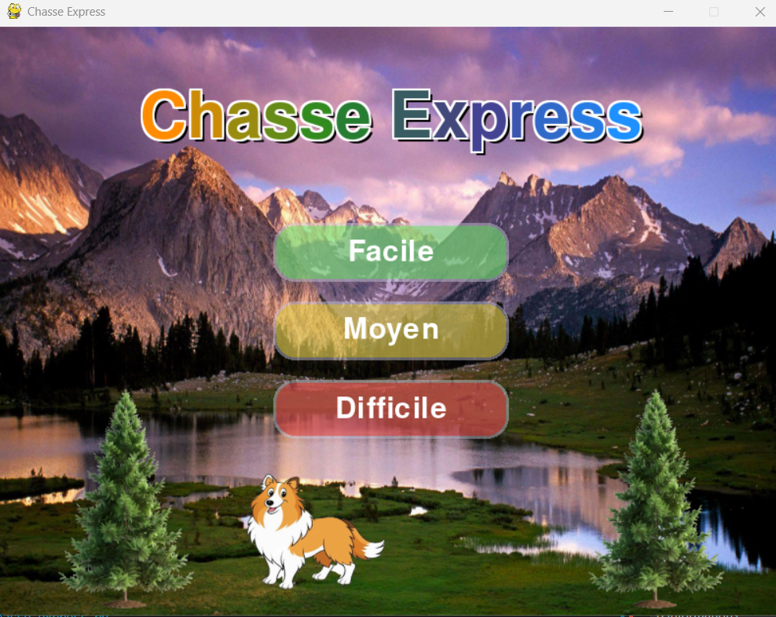

[](https://github.com/moyamelissa/Chasse_Express/actions)

# Chasse Express

**Chasse Express** is a 2D skill game developed in **Python** with **Pygame**. Play as a hunter accompanied by your loyal Sheltie dog, whose bark makes magpies appear and scares them away! Aim carefully and capture the required number of magpies before time runs out.

## 🎮 Overview

In Chasse Express, your goal is simple: **catch the magpies before time runs out.**
Your Sheltie doesn’t hunt, but he is your ally: **click on the dog to make him bark**, which brings the magpies out and sets them in motion. Then, aim and shoot at the magpies as they fly across the screen!
⚠️ Attention: you have a limited number of bullets and a countdown timer.

This game is a personal and modern reinterpretation inspired by the legendary **Duck Hunt**, which marked an entire generation of players.

## Features

- Three difficulty levels (Easy, Medium, Hard)
- Original animations and graphics
- Immersive sound environment
- Intuitive and accessible interface

## Installation

1. Install Python 3.x  
   https://www.python.org/downloads/

2. **Create a virtual environment** (recommended):  
   On Windows:
   ```
   python -m venv .venv
   .venv\Scripts\activate
   ```
   On macOS/Linux:
   ```
   python3 -m venv .venv
   source .venv/bin/activate
   ```

3. **Install dependencies**:
   ```
   pip install -r requirements.txt
   ```

4. Launch the game:
   ```
   python chasse_express.py
   ```

## Controls

- **Mouse**:
  - Click on the desired level in the menu.
  - Click on the dog to start the game.
  - Click on the magpies to catch them.

## Preview


## Credits

### Development
- **Code, graphics, and design**: Melissa Moya
- **Programming assistance**: GitHub Copilot

### Inspirations
- The province of Alberta
- The retro game Duck Hunt

### Game objects and assets
- **Sheltie**: https://vecteezy.com
- **Tree**: https://pngtree.com
- **Icons**: https://www.flaticon.com
- **Game background**: https://wallpaperaccess.com

### Graphic and audio resources
- **Music**: https://sounddino.com
- **Background**: https://wallpaperaccess.com
- **Image background removal**: https://remove.bg

## License

This project is licensed under the MIT License. See the [LICENSE](LICENSE) file for more information.

