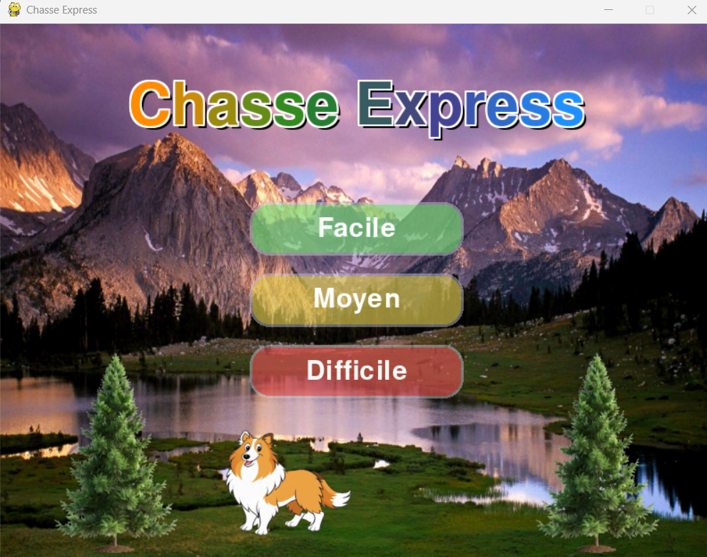

[](https://github.com/moyamelissa/Chasse_Express/actions)

# Chasse Express

**Chasse Express** est un jeu d’adresse en 2D développé en **Python** avec **Pygame**. Incarnez un chasseur accompagné de votre Sheltie fidèle, dont l’aboiement fait surgir et effraye les pies ! À vous de viser juste et de capturer le nombre de pies demandé avant la fin du temps imparti.

## 🎮 Présentation

Dans Chasse Express, votre objectif est simple : **capturer des pies avant la fin du temps imparti.**
Votre Sheltie ne chasse pas, mais il est votre allié : **cliquez sur le chien pour le faire aboyer**, ce qui fait apparaître les pies et les met en mouvement. Ensuite, visez et tirez sur les pies qui volent dans le paysage !
⚠️ Attention : munitions limitées et temps compté.


Ce jeu est une réinterprétation moderne et personelle, inspirée du légendaire **Duck Hunt**, qui a marqué toute une génération de joueurs.

## Fonctionnalités

- Trois niveaux de difficulté (Facile, Moyen, Difficile)
- Animations et graphismes originaux
- Ambiance sonore immersive
- Interface intuitive et accessible à tous

## Installation

### Windows

1. **Installez Python 3.x**  
   https://www.python.org/downloads/

2. **Naviguez vers le dossier du jeu** :
   ```bash
   cd "Chasse Express"
   ```

3. **Créez un environnement virtuel** (recommandé) :
   ```bash
   python -m venv .venv
   .venv\Scripts\activate
   ```

4. **Installez les dépendances** :
   ```bash
   pip install -r ../requirements.txt
   ```

5. **Lancez le jeu** :
   ```bash
   python main.py
   ```

### Linux/macOS

1. **Installez Python 3.x**  
   https://www.python.org/downloads/

2. **Installez les paquets requis** (Ubuntu/Debian seulement) :
   ```bash
   sudo apt install python3-pip python3-venv
   ```

3. **Naviguez vers le dossier du jeu** :
   ```bash
   cd "Chasse Express"
   ```

4. **Créez un environnement virtuel** (recommandé) :
   ```bash
   python3 -m venv .venv
   source .venv/bin/activate
   ```

5. **Installez les dépendances** :
   ```bash
   pip install -r ../requirements.txt
   ```

6. **Lancez le jeu** : 
   ```bash
   python3 main.py
   ```
   
## Commandes

- **Souris** :
  - Cliquez sur le niveau désiré dans le menu.
  - Cliquez sur le chien pour démarrer la partie.
  - Cliquez sur les pies pour les capturer.
 
## Aperçu


## Crédits

### Développement
- **Code, graphismes et conception** : Melissa Moya
- **Assistance à la programmation** : GitHub Copilot

### Inspirations
- La province de l'Alberta
- Le jeux rétro Duck Hunt

### Objets et éléments du jeu
- **Sheltie** : https://vecteezy.com
- **Arbre** : https://pngtree.com
- **Icônes** : https://www.flaticon.com
- **Arrière-plan du jeux** : https://wallpaperaccess.com

### Ressources graphiques et sonores
- **Musique** : https://sounddino.com
- **Arrière-plan** : https://wallpaperaccess.com
- **Détourage d’images**: https://remove.bg

## Licence

Ce projet est sous licence MIT. Voir le fichier [LICENSE](LICENSE) pour plus d’informations.
